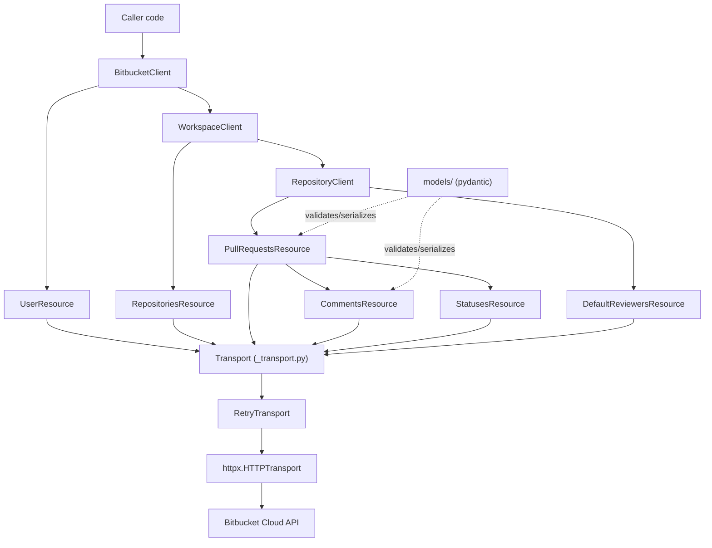
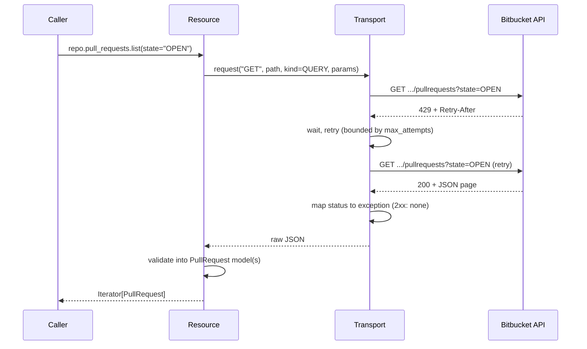
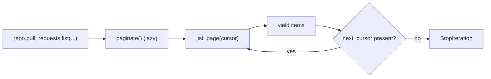

# Architecture

This document describes how the SDK is layered and the process for adding a
new Bitbucket endpoint. See [`coverage.md`](coverage.md) for the
endpoint-to-method mapping.

## Layering

`BitbucketClient` owns one `httpx.Client` and exposes `.user` (root-level) and
`.workspace(slug)`, which returns a `WorkspaceClient` bound to that workspace.
`WorkspaceClient.repository(slug)` returns a `RepositoryClient` bound to that
repository, exposing `.pull_requests` and `.default_reviewers`. Resource
objects never touch `httpx` directly — every request goes through
`_transport.Transport`, which owns auth, retries, and error mapping.
`models/` (pydantic) is used by every layer above transport to validate and
serialize payloads.

## Request lifecycle

Every request passes through the same auth → retry → error-mapping →
validation pipeline, regardless of which resource issued it.

Errors map through `errors.error_for_response`
(`AuthenticationError`/`ForbiddenError`/`NotFoundError`/`ConflictError`/
`ValidationError`/`RateLimitError`/`ServerError`) with `BitbucketAPIError` as
the fallback for any other non-2xx status.

## Pagination

Bitbucket collection endpoints return a `next` URL alongside `values` (and,
on the first page, `size`). `Page[T]` (`_pagination.py`) carries that as
`items`/`next_cursor`/`size`; `paginate()` wraps repeated `list_page(cursor=...)`
calls into a lazy `Iterator[T]`, re-requesting the literal `next` URL until it
is absent.

## Modeling

Every response is a frozen pydantic model (`BitbucketModel` base:
`populate_by_name=True`, `extra="allow"`, every field optional). Unlike the
sibling `clockify-sdk`, there is **no `alias_generator`** — Bitbucket's wire
names are already snake_case — so only the two reserved-word fields
(`Links.self_`, `CommentInline.from_`) carry an explicit `Field(alias=...)`.
Every field is optional because Bitbucket's `fields=` query parameter can
omit anything from any response.

Write payloads (`PullRequestCreate`, `CommentCreate`, ...) are separate models
from their read counterparts and serialize with
`model_dump(mode="json", by_alias=True, exclude_unset=True)`.

## Docstring policy and endpoint reference

This repository enforces `app-no-docstrings` (see `README.md`), so there is
no docstring-based endpoint reference. Every resource method carries a
`# METHOD /path` comment directly above its `def` naming the exact Bitbucket
endpoint it calls.

## Adding a new endpoint

1. Add or extend the pydantic model(s) in `src/bitbucket/models/`. Read
   models and write models (`XCreate`/`XUpdate`) are separate types.
2. Add the method to the relevant resource in `src/bitbucket/resources/`. If
   the resource is reachable as `{base_path}{_path}[/{id}]` and needs
   `create`/`get`/`list`/`update`, subclass `resources.base.NestedResource`;
   otherwise write it by hand and reuse `resources.base.page_from_payload`
   for pagination. Prefix the method with a `# METHOD /path` comment.
3. Declare the method's CQS kind — query, idempotent command, or
   non-idempotent command. The retry transport reads it to decide `5xx`
   eligibility, so getting it wrong either strips retry protection from a
   read or risks duplicating a write.
4. Add a unit test in `tests/unit/` asserting the exact HTTP method, path,
   query parameters, and body the method produces (respx).
5. Update `docs/coverage.md`: flip the endpoint's status to `done` and link
   the method.
6. Run `make check && make test` before committing.

## Release checklist

There is no CI for this repository yet. Before tagging a release:

1. `make check` — must exit 0.
2. `make test` — must exit 0, coverage gate (90%) must pass.
3. `uv build` — must produce a valid sdist and wheel.
4. Confirm `docs/coverage.md` reflects the endpoints actually shipped in this
   version.
5. Tag and publish.
