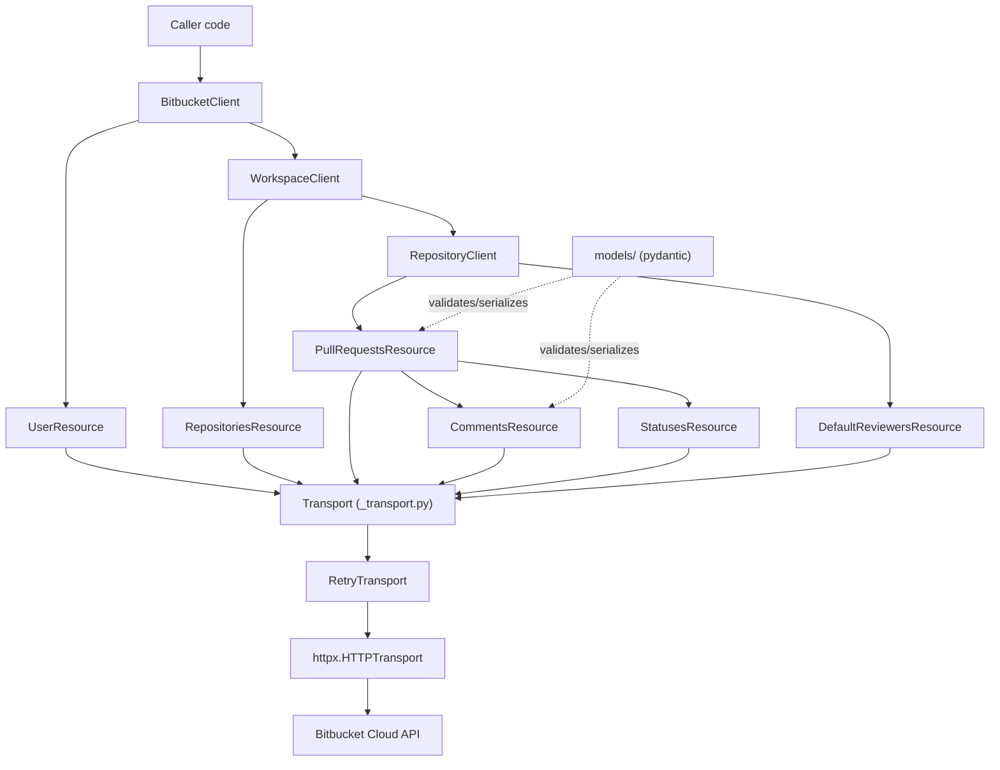

# Layering

`BitbucketClient` owns one `httpx.Client` and exposes `.user` (root-level) and
`.workspace(slug)`, which returns a `WorkspaceClient` bound to that workspace.
`WorkspaceClient.repository(slug)` returns a `RepositoryClient` bound to that
repository, exposing `.pull_requests` and `.default_reviewers`. Resource
objects never touch `httpx` directly — every request goes through
`_transport.Transport`, which owns auth, retries, and error mapping.
`models/` (pydantic) is used by every layer above transport to validate and
serialize payloads.

## Async mirror (`bitbucket.aio`)

`AsyncBitbucketClient` is a hand-written mirror under `bitbucket.aio`, not a
codegen product. It reuses every piece that has no I/O (`models/`,
`errors.py`, `retry.py`, `config.py`, `_auth.BasicAuth`, and
`resources.base.page_from_payload`) and duplicates only the I/O layer —
`aio/_transport.AsyncTransport`, `aio/_retry_transport.AsyncRetryTransport`,
`aio/_pagination.apaginate`, and `aio/_polling.apoll_until_terminal`. The
async resource tree is one module per sync resource (with the same class
name plus an `Async` prefix) under `bitbucket/aio/resources/`. Single-shot
methods become `async def`; auto-paginating methods return `AsyncIterator`
via `apaginate`. The rule that ships with every endpoint: mirror it in
`bitbucket/aio/resources/` and add a matching test in `tests/unit/aio/` —
see [`async-client.md`](async-client.md).
