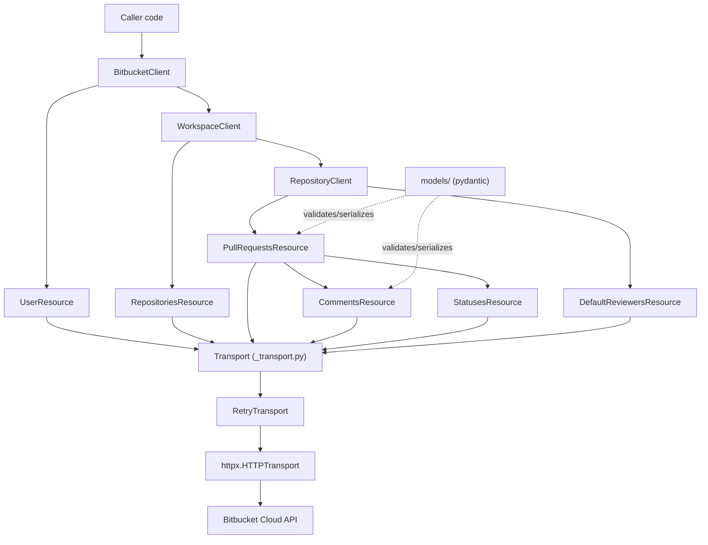

# Layering

`BitbucketClient` owns one `httpx.Client` and exposes `.user` (root-level) and
`.workspace(slug)`, which returns a `WorkspaceClient` bound to that workspace.
`WorkspaceClient.repository(slug)` returns a `RepositoryClient` bound to that
repository, exposing `.pull_requests` and `.default_reviewers`. Resource
objects never touch `httpx` directly — every request goes through
`_transport.Transport`, which owns auth, retries, and error mapping.
`models/` (pydantic) is used by every layer above transport to validate and
serialize payloads.

