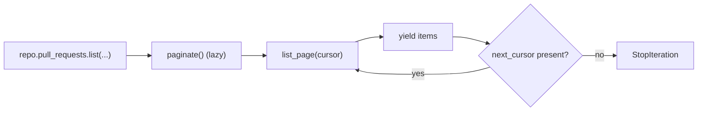

# Pagination

Bitbucket collection endpoints return a `next` URL alongside `values` (and,
on the first page, `size`). `Page[T]` (`_pagination.py`) carries that as
`items`/`next_cursor`/`size`; `paginate()` wraps repeated `list_page(cursor=...)`
calls into a lazy `Iterator[T]`, re-requesting the literal `next` URL until it
is absent.

