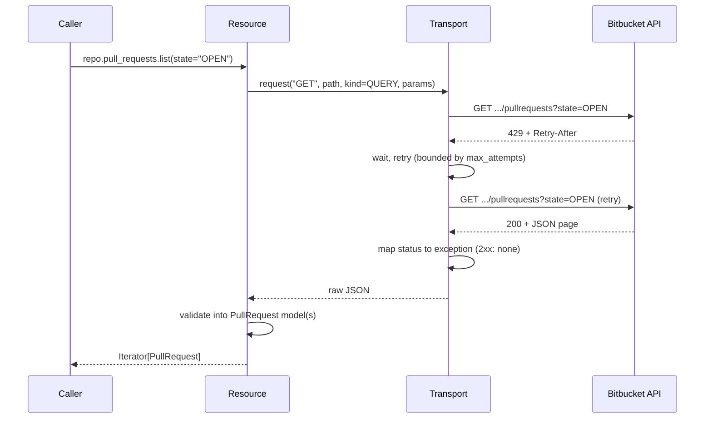

# Request lifecycle

Every request passes through the same auth → retry → error-mapping →
validation pipeline, regardless of which resource issued it.

Errors map through `errors.error_for_response`
(`AuthenticationError`/`ForbiddenError`/`NotFoundError`/`ConflictError`/
`ValidationError`/`RateLimitError`/`ServerError`) with `BitbucketAPIError` as
the fallback for any other non-2xx status.
